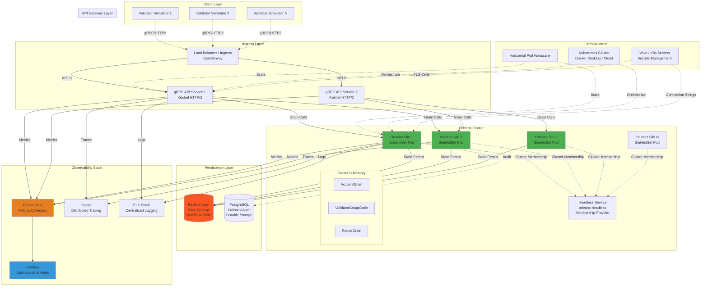
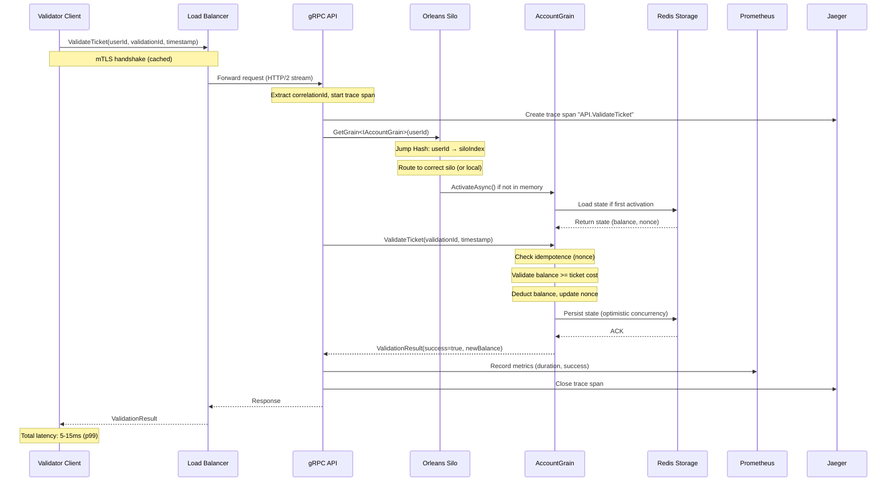

# Orleans Ticketing Backend - Architecture

## Vue d'ensemble

Système de ticketing account-based haute performance basé sur **Microsoft Orleans** pour supporter **1 million d'utilisateurs simultanés** effectuant des validations en temps réel avec une latence minimale (sub-milliseconde).

## Diagramme d'architecture



## Composants principaux

### 1. Client Layer - Validator Simulators

**Technologie**: .NET 8 gRPC Client avec connexion pooling

**Rôle**: Simule les validateurs de tickets répartis géographiquement

**Caractéristiques**:
- Connexions HTTP/2 persistantes avec keepalive
- Channel pooling pour réutilisation des connexions
- Support de 1M+ validateurs simultanés (via tests de charge k6)
- Retry exponential + circuit breaker (Polly)
- Correlation IDs pour traçabilité

**Pourquoi ce choix**:
- gRPC/HTTP2 offre multiplexing sur une seule connexion TCP
- Latence minimale (binary protocol, Protobuf)
- Streaming bidirectionnel pour batch validations

---

### 2. Ingress Layer - Load Balancer

**Technologie**: NGINX Ingress / Envoy Proxy

**Rôle**: Point d'entrée unique avec terminaison TLS

**Caractéristiques**:
- mTLS entre clients et backend
- Rate limiting (ex: 10k req/s par IP)
- Connection pooling upstream
- Health checks (readiness/liveness)

**Pourquoi ce choix**:
- Décharge la gestion TLS des pods applicatifs
- Centralise les policies de sécurité
- Support natif de gRPC (HTTP/2)

---

### 3. API Gateway Layer - gRPC Services

**Technologie**: ASP.NET Core 8 Kestrel avec gRPC services

**Rôle**: Frontend stateless recevant les requêtes et invoquant les grains Orleans

**Optimisations**:
- Server GC (`<ServerGarbageCollection>true</ServerGarbageCollection>`)
- ThreadPool tuning (`ThreadPool.SetMinThreads(200, 200)`)
- Kestrel limits: `MaxConcurrentConnections=10000`, `KeepAliveTimeout=120s`
- HTTP/2 MaxStreamsPerConnection=100
- System.Text.Json source generators pour sérialisation rapide
- ValueTask pour async/await sans allocation

**Pourquoi ce choix**:
- Kestrel est le serveur HTTP le plus performant .NET
- Séparation des concerns (API stateless, grains stateful)
- Scalabilité horizontale facile (HPA)

---

### 4. Orleans Cluster - Virtual Actors (Grains)

**Technologie**: Microsoft Orleans 8.x sur .NET 8

**Rôle**: Cœur du système - acteurs distribués gérant l'état des comptes et validations

#### Grains implémentés:

##### AccountGrain
- **Clé**: `userId` (string/GUID)
- **État**: Solde, billets valides, historique, nonce (pour idempotence)
- **Opérations**:
  - `ValidateTicket(validationId, timestamp)` → déduction solde
  - `GetBalance()` → lecture état
  - `Recharge(amount)` → crédit compte
- **Persistence**: Redis (rapide) + snapshot Postgres (durable)

##### ValidatorGroupGrain
- **Clé**: `validatorGroupId` (zone géographique)
- **Rôle**: Agrégation des validations d'une zone, routage vers AccountGrains
- **Optimisation**: Batch processing pour minimiser les appels réseau

##### RouterGrain (optionnel)
- **Rôle**: Centralise la logique de consistent hashing
- **Utilité**: Cache du mapping userId → siloId pour optimisation

#### Placement Strategy - Consistent Hashing

**Algorithme**: Jump Consistent Hash (Google)

**Avantages**:
- Minimisation du remapping lors d'ajout/suppression de silos (< 1/N keys moved)
- O(1) calcul du placement
- Distribution uniforme des grains

**Implémentation**:
```csharp
// Jump Consistent Hash: userId → siloIndex [0, N-1]
public static int JumpHash(ulong key, int numBuckets)
{
    long b = -1, j = 0;
    while (j < numBuckets)
    {
        b = j;
        key = key * 2862933555777941757UL + 1;
        j = (long)((b + 1) * ((double)(1L << 31) / (double)((key >> 33) + 1)));
    }
    return (int)b;
}
```

**Configuration Orleans**:
- Virtual nodes (vnodes) pour équilibrage fin
- StatefulSet Kubernetes pour identités de silos stables
- Membership Table via Kubernetes Headless Service

---

### 5. Persistence Layer

#### Redis Cluster (Primary)

**Rôle**: Storage rapide pour état des grains (hot data)

**Configuration**:
- Cluster mode avec 3+ master nodes, 3+ replicas
- Persistence: AOF (Append-Only File) + RDB snapshots
- Latency p99 < 1ms
- IOPS: 50k+ ops/sec par node

**Pourquoi Redis**:
- Latence ultra-faible (in-memory)
- Support natif Orleans (Orleans.Persistence.Redis)
- Atomic operations pour optimistic concurrency

#### PostgreSQL (Fallback/Audit)

**Rôle**: Storage durable pour audit trail et snapshots

**Configuration**:
- Index sur userId, timestamp
- Partitioning par date pour scalabilité

**Pourquoi Postgres**:
- ACID compliance pour audit
- Support SQL pour analytics
- Fallback si Redis indisponible

---

### 6. Observability Stack

#### Prometheus + Grafana

**Metrics collectées**:
- **Application**:
  - `ticketing_validations_total` (counter)
  - `ticketing_validation_duration_seconds` (histogram p50/p95/p99/p999)
  - `ticketing_account_balance_changes` (counter)
  - `orleans_grain_activations` (gauge)
  - `orleans_silo_cpu_usage` (gauge)
- **Infrastructure**:
  - CPU/Memory per pod
  - Network I/O
  - Disk IOPS (Redis)

**Dashboards Grafana**:
1. **Overview**: Throughput global, latence p99, error rate
2. **Orleans**: Grain activations, message queues, remoting latency
3. **Infrastructure**: CPU/Mem/Network per node
4. **Business**: Validations par zone, top users

**Alertes**:
- p99 latency > 100ms
- Error rate > 1%
- CPU > 80% pendant 5min

#### Jaeger - Distributed Tracing

**Rôle**: Traçage des requêtes end-to-end

**Traces**:
- Client gRPC call → API → Grain → Redis → Response
- Span IDs pour corrélation avec logs

**Pourquoi Jaeger**:
- OpenTelemetry native support
- Analyse des tail latencies
- Identification des bottlenecks

#### ELK Stack - Logging

**Rôle**: Centralisation des logs JSON structurés

**Configuration**:
- Fluentd agents sur chaque node
- Elasticsearch indexing par timestamp + correlationId
- Kibana dashboards pour troubleshooting

**Format de log** (Serilog):
```json
{
  "timestamp": "2025-11-16T10:23:45.123Z",
  "level": "Information",
  "correlationId": "abc-123",
  "validationId": "val-xyz",
  "userId": "user-456",
  "message": "Ticket validated successfully",
  "latencyMs": 12.3,
  "grainId": "AccountGrain-user-456"
}
```

---

### 7. Infrastructure - Kubernetes

#### StatefulSet pour Orleans Silos

**Pourquoi StatefulSet**:
- Identités de pods stables (`orleans-silo-0`, `orleans-silo-1`, ...)
- Volumes persistants si besoin de cache local
- Graceful scaling (terminaison ordonnée des grains)

**Configuration**:
```yaml
replicas: 5  # Initial, puis HPA
resources:
  requests:
    cpu: 2000m
    memory: 4Gi
  limits:
    cpu: 4000m
    memory: 8Gi
```

#### Headless Service pour Membership

**Rôle**: Service discovery pour le cluster Orleans

**Configuration**:
```yaml
apiVersion: v1
kind: Service
metadata:
  name: orleans-headless
spec:
  clusterIP: None  # Headless
  selector:
    app: orleans-silo
  ports:
  - name: orleans
    port: 11111
  - name: gateway
    port: 30000
```

**Orleans Kubernetes Membership**:
```csharp
siloBuilder.UseKubernetesHosting(
    serviceName: "orleans-headless",
    clusterId: "ticketing-cluster",
    serviceId: "ticketing-service"
);
```

#### Horizontal Pod Autoscaler (HPA)

**Metrics**:
- CPU > 70% → scale up
- Custom metric: `avg(ticketing_validation_duration_seconds) > 0.05` → scale up

**Configuration**:
```yaml
minReplicas: 3
maxReplicas: 100
targetCPUUtilizationPercentage: 70
```

#### Pod Disruption Budget (PDB)

**Rôle**: Garantir disponibilité lors des rolling updates

```yaml
minAvailable: 2  # Au moins 2 silos toujours up
```

#### Network Policy

**Rôle**: Isolation réseau (zero-trust)

```yaml
# Autoriser seulement API → Silos, Silos ↔ Silos, Silos → Redis
```

---

## Flux de données - Validation de ticket



---

## Sizing initial et recommandations

### Pour tests locaux (Docker Desktop)

**Configuration minimale**:
- 3 silos Orleans (StatefulSet replicas: 3)
- 2 API pods (Deployment replicas: 2)
- 1 Redis instance (single node, dev mode)
- Prometheus + Grafana (1 pod each)

**Ressources Docker Desktop**:
- CPU: 8 cores minimum
- RAM: 16 GB minimum
- Disk: 50 GB SSD

**Charge simulée**: 10k-50k validations/sec (k6 progressive ramp)

---

### Pour production (1M users, cloud)

**Calcul théorique**:

Hypothèses:
- 1M users simultanés
- Chaque user: 1 validation toutes les 30 secondes → 33k validations/sec
- Latence cible p99 < 50ms
- CPU par validation: ~0.5ms (mesure réelle après tests)

**Sizing silos**:
- Capacité par silo: ~2000 validations/sec (4 vCPU, 8 GB RAM)
- Nombre de silos: 33k / 2000 = **17 silos** (+ 20% marge = **20 silos**)

**Sizing API**:
- API stateless, CPU-bound
- Capacité par pod: ~5000 req/sec (2 vCPU)
- Nombre de pods: 33k / 5000 = **7 pods** (+ marge = **10 pods**)

**Redis**:
- 1M accounts × 2 KB state = 2 GB working set
- Redis Cluster: 3 masters + 3 replicas
- Specs par master: 4 vCPU, 8 GB RAM, 10k IOPS SSD

**Total infrastructure** (estimation):
- Silos: 20 × (4 vCPU, 8 GB) = 80 vCPU, 160 GB RAM
- API: 10 × (2 vCPU, 4 GB) = 20 vCPU, 40 GB RAM
- Redis: 6 × (4 vCPU, 8 GB) = 24 vCPU, 48 GB RAM
- **Total**: ~130 vCPU, ~250 GB RAM

**Coût cloud estimé** (AWS/Azure): $1500-2500/mois (instances spot)

---

## Sécurité

### 1. Transport Layer Security (TLS/mTLS)

- **Client → LB**: mTLS avec certificats client validés
- **LB → API**: TLS 1.3
- **API → Silos**: TLS intra-cluster (optional, perf impact)

### 2. Authentication & Authorization

- **Validators**: JWT tokens avec scope validation
- **API**: Validation JWT middleware
- **Rate limiting**: 100 req/s per validator

### 3. Kubernetes RBAC

- Service accounts distincts pour API, Silos, Monitoring
- Principe du moindre privilège (least privilege)

### 4. Secrets Management

- **Kubernetes Secrets** (dev) ou **HashiCorp Vault** (prod)
- Rotation automatique des secrets (TLS certs, Redis passwords)
- Encryption at rest (etcd encryption)

### 5. Network Policies

```yaml
# Deny all by default, allow only:
# - API → Silos (port 11111, 30000)
# - Silos ↔ Silos (clustering)
# - Silos → Redis (port 6379)
# - All → Prometheus (metrics scraping)
```

### 6. Audit Logging

- Tous les accès aux comptes loggés (correlationId)
- Retention: 90 jours
- Immutabilité (write-only logs)

---

## Résilience

### 1. Retry + Exponential Backoff (Polly)

```csharp
// Client → API
var retryPolicy = Policy
    .Handle<RpcException>()
    .WaitAndRetryAsync(
        retryCount: 3,
        sleepDurationProvider: attempt => TimeSpan.FromMilliseconds(Math.Pow(2, attempt) * 100),
        onRetry: (exception, timeSpan, retryCount, context) =>
        {
            _logger.LogWarning("Retry {RetryCount} after {Delay}ms", retryCount, timeSpan.TotalMilliseconds);
        });
```

### 2. Circuit Breaker

```csharp
// API → Redis (fallback to Postgres)
var circuitBreaker = Policy
    .Handle<RedisConnectionException>()
    .CircuitBreakerAsync(
        handledEventsAllowedBeforeBreaking: 5,
        durationOfBreak: TimeSpan.FromSeconds(30),
        onBreak: (exception, duration) => _logger.LogError("Circuit opened for {Duration}", duration),
        onReset: () => _logger.LogInformation("Circuit closed"));
```

### 3. Backpressure & Rate Limiting

- **API**: Semaphore limit sur concurrent requests
- **Grains**: Queue limit (max 1000 pending messages)
- **Redis**: Connection pool limit

### 4. Graceful Shutdown

```csharp
// Silo shutdown
await silo.StopAsync(
    cancellationToken: new CancellationTokenSource(TimeSpan.FromSeconds(60)).Token);
// Permet aux grains de se déactiver proprement (flush state)
```

### 5. Idempotence

- **ValidationId unique** par requête (GUID client-side)
- **Nonce** dans AccountGrain pour détecter duplicates
- **Deduplication window**: 5 minutes

---

## Tests de performance

### Stratégie de test de charge (k6)

**Phases**:
1. **Warmup**: 1k users, 2 min (activation grains, caches)
2. **Ramp 1**: 1k → 10k users, 5 min
3. **Plateau 1**: 10k users, 10 min (mesure baseline)
4. **Ramp 2**: 10k → 100k users, 10 min
5. **Plateau 2**: 100k users, 20 min (stress test)
6. **Ramp 3**: 100k → 500k users, 20 min
7. **Plateau 3**: 500k users, 30 min
8. **Ramp 4**: 500k → 1M users, 30 min (ultimate test)
9. **Plateau 4**: 1M users, 60 min (soak test)
10. **Rampdown**: 1M → 0, 10 min

**Metrics à capturer**:
- Latency: p50, p95, p99, p99.9, p99.99, max
- Throughput: req/s, validations/s
- Error rate: % failed requests
- Infrastructure: CPU, Memory, Network, Disk IOPS

**Critères de succès**:
- p99 latency < 50ms (objectif: < 20ms)
- p99.9 latency < 100ms
- Error rate < 0.01%
- CPU < 80% sustained
- No memory leaks (stable memory over soak test)

---

## CI/CD Pipeline

### GitHub Actions Workflow

**Stages**:
1. **Build**: `dotnet build --configuration Release`
2. **Test**: `dotnet test --logger "console;verbosity=detailed"`
3. **Security Scan**: Trivy / Snyk for vulnerabilities
4. **Docker Build**: Multi-stage Dockerfile → push to registry
5. **Helm Package**: `helm package ./deploy/helm/ticketing`
6. **Deploy to Dev**: `helm upgrade --install ticketing ./ticketing-*.tgz`
7. **Smoke Tests**: gRPC health check + sample validations
8. **Load Test (optional)**: k6 mini test (10k users)
9. **Deploy to Staging** (manual approval)
10. **Deploy to Prod** (manual approval + blue/green)

**Triggers**:
- Push to `main`: full pipeline
- Pull request: build + test + security scan
- Tag `v*`: full pipeline + prod deployment

---

## Documentation opérationnelle (Runbooks)

Voir fichiers dédiés:
- `docs/runbooks/DEPLOYMENT.md`: Procédures de déploiement
- `docs/runbooks/SCALING.md`: Scaling horizontal/vertical
- `docs/runbooks/INCIDENT_RESPONSE.md`: Procédures en cas d'incident
- `docs/runbooks/BACKUP_RESTORE.md`: Sauvegarde et restauration Redis/Postgres
- `docs/runbooks/BLUE_GREEN_DEPLOY.md`: Déploiement sans downtime

---

## Conclusion

Cette architecture a été conçue pour:

1. **Performance**: Latence p99 < 50ms (objectif < 20ms) grâce à:
   - gRPC/HTTP2 (binary protocol)
   - Orleans in-memory grains
   - Redis ultra-rapide
   - .NET 8 optimizations (Server GC, ThreadPool tuning)

2. **Scalabilité**: 1M+ users grâce à:
   - Consistent hashing (minimal reshuffling)
   - StatefulSet pour silos stables
   - HPA pour scaling automatique
   - Redis Cluster pour storage distribué

3. **Résilience**: 99.99% uptime grâce à:
   - Retry + circuit breaker
   - PodDisruptionBudget
   - Graceful shutdown
   - Multi-AZ deployment (cloud)

4. **Observabilité**: Full visibility grâce à:
   - OpenTelemetry distributed tracing
   - Prometheus + Grafana (dashboards & alerts)
   - Structured logging (ELK)

5. **Sécurité**: Production-grade grâce à:
   - mTLS + JWT
   - RBAC + NetworkPolicy
   - Secrets management (Vault)
   - Audit logging

**Prêt pour production et tests de charge à 1M users !** 🚀
